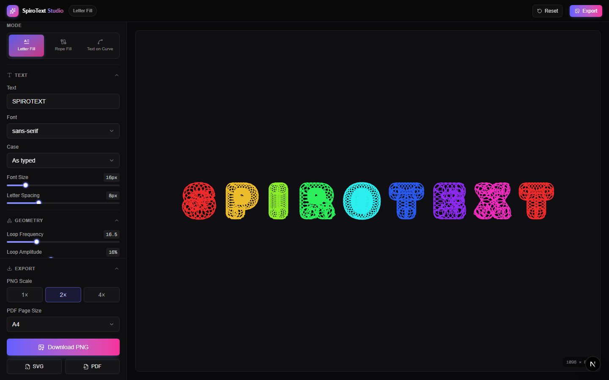
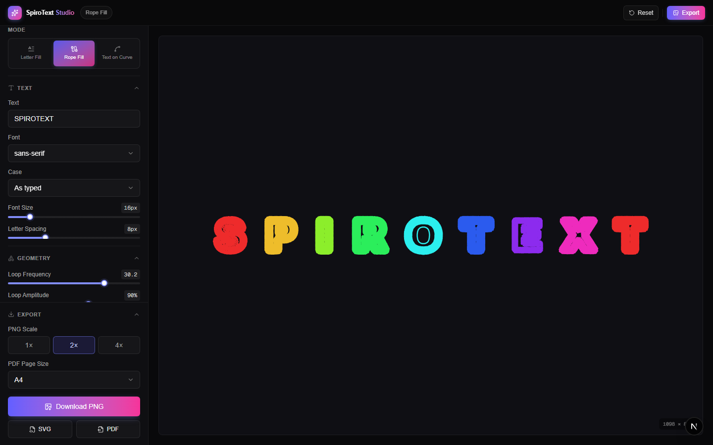
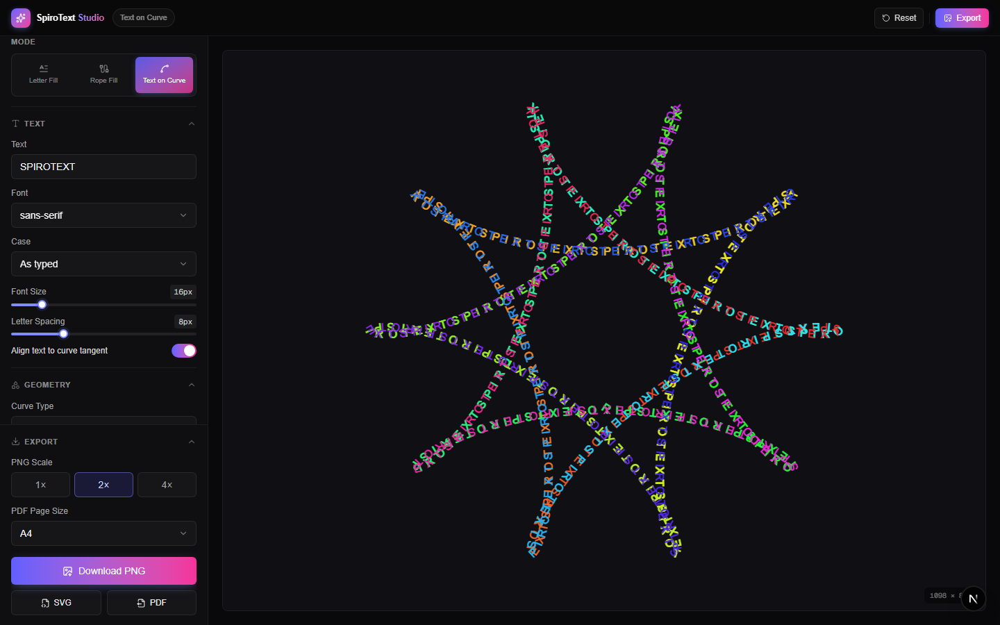

# SpiroText Studio

Turn text into intricate spirograph art — trace letters with rolling-loop patterns, ride text along a classic hypotrochoid/epitrochoid/rose/Lissajous curve, and export the result as a print-ready PNG, SVG, or PDF.

Built with Next.js 16, React 19, Zustand, and an HTML5 Canvas rendering engine.

## Screenshots

### Letter Fill
Loops trace each letter's own glyph outline, including its holes.



### Rope Fill
The glyph's ink and counters are eroded into concentric bands, each looped — loops stay bounded by the stroke width, and holes fill with a converging spiral.



### Text on Curve
Letters ride along one big spirograph curve (hypotrochoid, epitrochoid, rose, or Lissajous).



## Features

- **Three render modes** — Letter Fill, Rope Fill, and Text on Curve, each with its own geometry controls.
- **Text styling** — custom text, font family, size, letter spacing, text case, and (in curve mode) tangent alignment.
- **Curve math** — hypotrochoid, epitrochoid, rose, and Lissajous curves with adjustable outer/inner radius, pen distance, revolutions, and step resolution.
- **Loop controls** — independent frequency, amplitude, and pass/revolution counts per mode for fine-tuning how densely the pattern fills.
- **Appearance** — solid, gradient, or rainbow (hue-shift) coloring, adjustable stroke weight, glow, and transparent/solid backgrounds.
- **Export** — download as PNG (1×/2×/4× scale), SVG, or a print-ready PDF (A4, Letter, Square, or 18×24in poster).
- **Installable PWA** — ships with a web app manifest and icon.

## Getting started

This project uses [pnpm](https://pnpm.io).

```bash
pnpm install
pnpm dev
```

Open [http://localhost:3000](http://localhost:3000) in your browser. The page auto-updates as you edit files under `src/`.

## Documentation

See [docs/index.md](docs/index.md) for more:

- [Architecture](docs/architecture.md) — project structure and how the render pipeline works
- [Development](docs/development.md) — scripts and deployment
- [Tech stack](docs/tech-stack.md) — libraries used and why

## License

[MIT](LICENSE)
